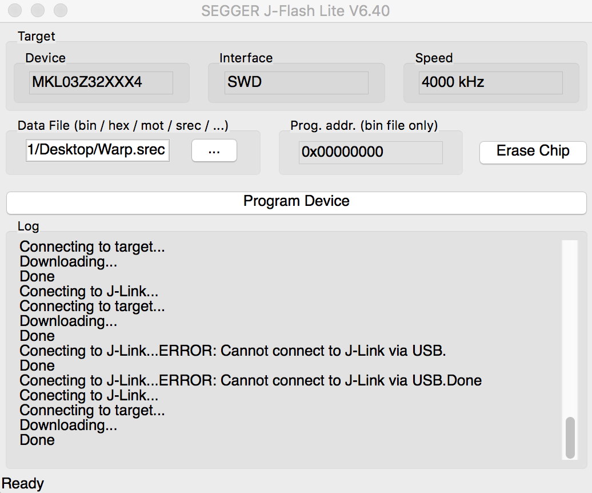
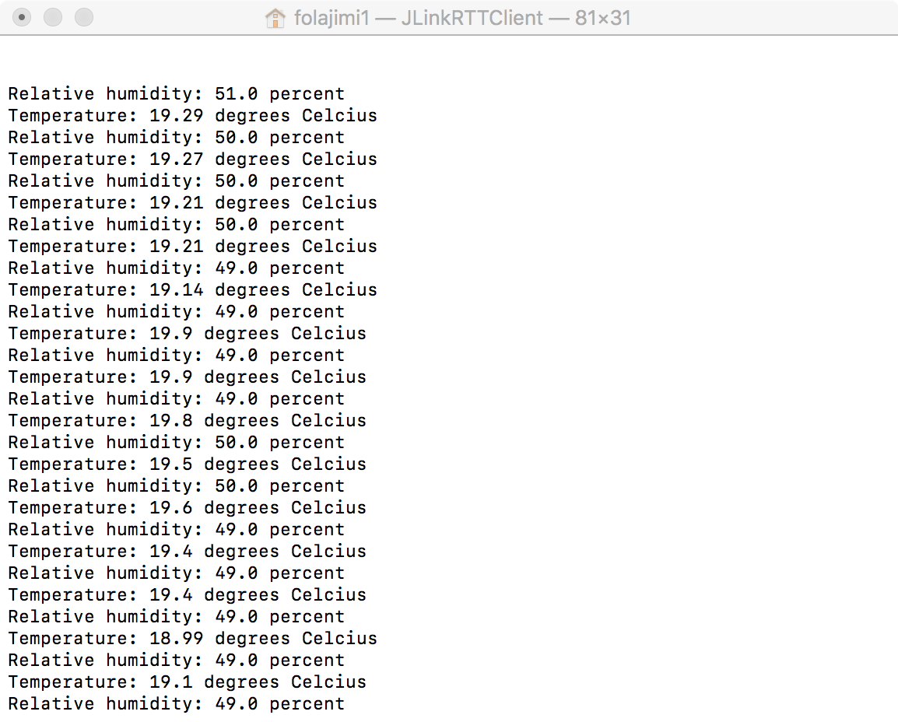

# Plant Monitoring System
#### Olufolajimi Babasola (ob304), Queens' College, Cambridge

A temperature and relative humidity monitoring system for indoor farms. Based on [Warp Firmware](https://github.com/physical-computation/Warp-firmware) by Philip Stanley-Marbell and Martin Rinard

## Getting Started

### Prerequisites
From [Warp Firmware](https://github.com/physical-computation/Warp-firmware).

You need an arm cross-compiler such as `arm-none-eabi-gcc` installed as well as a working `cmake` (installed, e.g., `apt-get` on Linux or via [MacPorts](https://www.macports.org/) on macOS). You will also need an installed copy of the SEGGER [JLink commander](https://www.segger.com/downloads/jlink/), `JlinkExe`, which is available for Linux, macOS, and Windows (here are direct links for downloading it for [macOS](https://www.segger.com/downloads/jlink/JLink_MacOSX.pkg), and [Linux tgz 64-bit](https://www.segger.com/downloads/jlink/JLink_Linux_x86_64.tgz)).

### Hardware
The Warp Firmware on which this firmware is based was designed to run on the Warp hardware, but also runs on the Freescale FRDM KL03 development board. This firmware was developed on the KL03, so this will be required to use it.

### Installation

From [Warp Firmware](https://github.com/physical-computation/Warp-firmware).

First, make sure the environment variable  `ARMGCC_DIR`  is set correctly (you can check whether this is set correctly, e.g., via  `echo $ARMGCC_DIR`. If this is unfamiliar, see  [here](http://homepages.uc.edu/~thomam/Intro_Unix_Text/Env_Vars.html)  or  [here](https://www2.cs.duke.edu/csl/docs/csh.html)). If your  `arm-none-eabi-gcc`  is in  `/usr/local/bin/arm-none-eabi-gcc`, then you want to set  `ARMGCC_DIR`  to  `/usr/local`. If your shell is  `tcsh`:

	setenv ARMGCC_DIR <full path to the directory containing bin/arm-none-eabi-gcc>

Alternatively, if your shell is  `bash`

	export ARMGCC_DIR=<full path to the directory containing bin/arm-none-eabi-gcc>

(You can check what your shell is, e.g., via  `echo $SHELL`.) Second, edit the jlink command file,  `tools/scripts/jlink.commands`  to include the correct path.

Third, you should be able to build the Warp firmware by

	cd build/ksdk1.1/
	./build.sh

This copies the files from  `Warp/src/boot/ksdk1.1.0/`  into the KSDK tree, builds, and converts the binary to SREC. See  `Warp/src/boot/ksdk1.1.0/README.md`  for more.

## Usage

Connect the KL03 to you computer and open the SEGGER interface. On mac, this should look like this: 

Erase the chip, upload the SREC file generated and program the device.

You will need two terminal windows. In one shell window, run the firmware downloader. On MacOS, this will be:
	
	/Applications/SEGGER/JLink/JLinkExe -device MKL03Z32XXX4 -if SWD -speed 100000
	
In the second shell window, launch the JLink RTT client. On MacOS, this will be:

	/Applications/SEGGER/JLink/JLinkRTTClient

The JLink RTT client will display the temperature and humidity readings. On MacOS, this should look like this:

## Acknowledgements

Phillip Stanley-Marbell and Martin Rinard. “A Hardware Platform for Efficient Multi-Modal Sensing with Adaptive Approximation”. ArXiv e-prints (2018). arXiv:1804.09241.
